# Module 5 - Ingest and load data into the Data Warehouse

This module teaches you how to ingest data into the data warehouse through T-SQL scripts and Synapse Analytics integration pipelines. You will learn how to load data into Synapse dedicated SQL pools with PolyBase and COPY using T-SQL. You will also learn how to use workload management along with a Copy activity in a Azure Synapse pipeline for petabyte-scale data ingestion.

After completing this module, you will be able to:

- Perform petabyte-scale ingestion with Azure Synapse Pipelines
- Import data with PolyBase and COPY using T-SQL
- Use data loading best practices in Azure Synapse Analytics

## Lab details

- [Module 5 - Ingest and load data into the Data Warehouse](#module-5---ingest-and-load-data-into-the-data-warehouse)
  - [Lab details](#lab-details)
  - [Lab setup and pre-requisites](#lab-setup-and-pre-requisites)
  - [Exercise 0: Start the dedicated SQL pool](#exercise-0-start-the-dedicated-sql-pool)
  - [Exercise 1: Import data with PolyBase and COPY using T-SQL](#exercise-1-import-data-with-polybase-and-copy-using-t-sql)
    - [Task 1: Create staging tables](#task-1-create-staging-tables)
    - [Task 2: Configure and run PolyBase load operation](#task-2-configure-and-run-polybase-load-operation)
    - [Task 3: Configure and run the COPY statement](#task-3-configure-and-run-the-copy-statement)
    - [Task 4: Use COPY to load text file with non-standard row delimiters](#task-4-use-copy-to-load-text-file-with-non-standard-row-delimiters)
    - [Task 5: Use PolyBase to load text file with non-standard row delimiters](#task-5-use-polybase-to-load-text-file-with-non-standard-row-delimiters)
  - [Exercise 2: Petabyte-scale ingestion with Azure Synapse Pipelines](#exercise-2-petabyte-scale-ingestion-with-azure-synapse-pipelines)
    - [Task 1: Configure workload management classification](#task-1-configure-workload-management-classification)
    - [Task 2: Create pipeline with copy activity](#task-2-create-pipeline-with-copy-activity)
  - [Exercise 3: Cleanup](#exercise-3-cleanup)
    - [Task 1: Pause the dedicated SQL pool](#task-1-pause-the-dedicated-sql-pool)

## Lab setup and pre-requisites

- Before starting this lab, you must complete **Lab 4: *Explore, transform, and load data into the Data Warehouse using Apache Spark***.

## Exercise 0: Start the dedicated SQL pool

This lab uses the dedicated SQL pool you created in the previous lab. As a first step, make sure it is not paused. If so, start it by following these instructions:

1. Open Synapse Studio (<https://web.azuresynapse.net/>).

2. Select the **Manage** hub.

    

3. Select **SQL pools** in the left-hand menu **(1)**. If the dedicated SQL pool is paused, hover over the name of the pool and select **Resume (2)**.

    

4. When prompted, select **Resume**. It will take a minute or two to resume the pool.

    

    > **Continue to the next exercise** while the dedicated SQL pool resumes.

## Exercise 1: Import data with PolyBase and COPY using T-SQL

There are different options for loading large amounts and varying types of data into Azure Synapse Analytics, such as through T-SQL commands using a Synapse SQL Pool, and with Azure Synapse pipelines. In our scenario, Wide World Importers stores most of their raw data in a data lake and in different formats. Among the data loading options available to them, WWI's data engineers are most comfortable using T-SQL.

However, even with their familiarity with SQL, there are some things to consider when loading large or disparate file types and formats. Since the files are stored in ADLS Gen2, WWI can use either PolyBase external tables or the new COPY statement. Both options enable fast and scalable data load operations, but there are some differences between the two:

| PolyBase | COPY |
| --- | --- |
| Needs `CONTROL` permission | Relaxed permission |
| Has row width limits | No row width limit |
| No delimiters within text | Supports delimiters in text |
| Fixed line delimiter | Supports custom column and row delimiters |
| Complex to set up in code | Reduces amount of code |

WWI has heard that PolyBase is generally faster than COPY, especially when working with large data sets.

In this exercise, you will help WWI compare ease of setup, flexibility, and speed between these loading strategies.

### Task 1: Create staging tables

The `Sale` table has a columnstore index to optimize for read-heavy workloads. It is also used heavily for reporting and ad-hoc queries. To achieve the fastest loading speed and minimize the impact of heavy data inserts on the `Sale` table, WWI has decided to create a staging table for loads.

In this task, you will create a new staging table named `SaleHeap` in a new schema named `wwi_staging`. You will define it as a [heap](https://docs.microsoft.com/sql/relational-databases/indexes/heaps-tables-without-clustered-indexes?view=sql-server-ver15) and use round-robin distribution. When WWI finalizes their data loading pipeline, they will load the data into `SaleHeap`, then insert from the heap table into `Sale`. Although this is a two-step process, the second step of inserting the rows to the production table does not incur data movement across the distributions.

You will also create a new `Sale` clustered columnstore table within the `wwi_staging` to compare data load speeds.

1. Open Synapse Analytics Studio (<https://web.azuresynapse.net/>), and then navigate to the **Develop** hub.

    

2. From the **Develop** menu, select the + button and choose **SQL Script** from the context menu.

    

3. In the toolbar menu, connect to the **SQLPool01** database to execute the query.

    

4. In the query window, replace the script with the following to create the `wwi_staging` schema:

    ```sql
    CREATE SCHEMA [wwi_staging]
    ```
5. Select **Run** from the toolbar menu to execute the SQL command.

    

    > **Note:** If you receive the following error, continue to the next step: `Failed to execute query. Error: There is already an object named 'wwi_staging' in the database. CREATE SCHEMA failed due to previous errors.`

6. In the query window, replace the script with the following to create the heap table:

    ```sql
    CREATE TABLE [wwi_staging].[SaleHeap]
    ( 
        [TransactionId] [uniqueidentifier]  NOT NULL,
        [CustomerId] [int]  NOT NULL,
        [ProductId] [smallint]  NOT NULL,
        [Quantity] [smallint]  NOT NULL,
        [Price] [decimal](9,2)  NOT NULL,
        [TotalAmount] [decimal](9,2)  NOT NULL,
        [TransactionDate] [int]  NOT NULL,
        [ProfitAmount] [decimal](9,2)  NOT NULL,
        [Hour] [tinyint]  NOT NULL,
        [Minute] [tinyint]  NOT NULL,
        [StoreId] [smallint]  NOT NULL
    )
    WITH
    (
        DISTRIBUTION = ROUND_ROBIN,
        HEAP
    )
    ```

7. Select **Run** from the toolbar menu to execute the SQL command.

8. In the query window, replace the script with the following to create the `Sale` table in the `wwi_staging` schema for load comparisons:

    ```sql
    CREATE TABLE [wwi_staging].[Sale]
    (
        [TransactionId] [uniqueidentifier]  NOT NULL,
        [CustomerId] [int]  NOT NULL,
        [ProductId] [smallint]  NOT NULL,
        [Quantity] [smallint]  NOT NULL,
        [Price] [decimal](9,2)  NOT NULL,
        [TotalAmount] [decimal](9,2)  NOT NULL,
        [TransactionDate] [int]  NOT NULL,
        [ProfitAmount] [decimal](9,2)  NOT NULL,
        [Hour] [tinyint]  NOT NULL,
        [Minute] [tinyint]  NOT NULL,
        [StoreId] [smallint]  NOT NULL
    )
    WITH
    (
        DISTRIBUTION = HASH ( [CustomerId] ),
        CLUSTERED COLUMNSTORE INDEX,
        PARTITION
        (
            [TransactionDate] RANGE RIGHT FOR VALUES (20100101, 20100201, 20100301, 20100401, 20100501, 20100601, 20100701, 20100801, 20100901, 20101001, 20101101, 20101201, 20110101, 20110201, 20110301, 20110401, 20110501, 20110601, 20110701, 20110801, 20110901, 20111001, 20111101, 20111201, 20120101, 20120201, 20120301, 20120401, 20120501, 20120601, 20120701, 20120801, 20120901, 20121001, 20121101, 20121201, 20130101, 20130201, 20130301, 20130401, 20130501, 20130601, 20130701, 20130801, 20130901, 20131001, 20131101, 20131201, 20140101, 20140201, 20140301, 20140401, 20140501, 20140601, 20140701, 20140801, 20140901, 20141001, 20141101, 20141201, 20150101, 20150201, 20150301, 20150401, 20150501, 20150601, 20150701, 20150801, 20150901, 20151001, 20151101, 20151201, 20160101, 20160201, 20160301, 20160401, 20160501, 20160601, 20160701, 20160801, 20160901, 20161001, 20161101, 20161201, 20170101, 20170201, 20170301, 20170401, 20170501, 20170601, 20170701, 20170801, 20170901, 20171001, 20171101, 20171201, 20180101, 20180201, 20180301, 20180401, 20180501, 20180601, 20180701, 20180801, 20180901, 20181001, 20181101, 20181201, 20190101, 20190201, 20190301, 20190401, 20190501, 20190601, 20190701, 20190801, 20190901, 20191001, 20191101, 20191201)
        )
    )
    ```

9. Select **Run** from the toolbar menu to execute the SQL command.

### Task 2: Configure and run PolyBase load operation

PolyBase requires the following elements:

- An external data source that points to the `abfss` path in ADLS Gen2 where the Parquet files are located
- An external file format for Parquet files
- An external table that defines the schema for the files, as well as the location, data source, and file format

1. In the query window, replace the script with the following to create the external data source. Be sure to replace `SUFFIX` with the lab workspace id:

    ```sql
    -- Replace SUFFIX with the lab workspace id.
    CREATE EXTERNAL DATA SOURCE ABSS
    WITH
    ( TYPE = HADOOP,
        LOCATION = 'abfss://wwi-02@asadatalakeSUFFIX.dfs.core.windows.net'
    );
    ```

    You can find the lab workspace id at the end of the Synapse Analytics workspace name, as well as your user name:

    

2. Select **Run** from the toolbar menu to execute the SQL command.

3. In the query window, replace the script with the following to create the external file format and external data table. Notice that we defined `TransactionId` as an `nvarchar(36)` field instead of `uniqueidentifier`. This is because external tables do not currently support `uniqueidentifier` columns:

    ```sql
    CREATE EXTERNAL FILE FORMAT [ParquetFormat]
    WITH (
        FORMAT_TYPE = PARQUET,
        DATA_COMPRESSION = 'org.apache.hadoop.io.compress.SnappyCodec'
    )
    GO

    CREATE SCHEMA [wwi_external];
    GO

    CREATE EXTERNAL TABLE [wwi_external].Sales
        (
            [TransactionId] [nvarchar](36)  NOT NULL,
            [CustomerId] [int]  NOT NULL,
            [ProductId] [smallint]  NOT NULL,
            [Quantity] [smallint]  NOT NULL,
            [Price] [decimal](9,2)  NOT NULL,
            [TotalAmount] [decimal](9,2)  NOT NULL,
            [TransactionDate] [int]  NOT NULL,
            [ProfitAmount] [decimal](9,2)  NOT NULL,
            [Hour] [tinyint]  NOT NULL,
            [Minute] [tinyint]  NOT NULL,
            [StoreId] [smallint]  NOT NULL
        )
    WITH
        (
            LOCATION = '/sale-small/Year=2019',  
            DATA_SOURCE = ABSS,
            FILE_FORMAT = [ParquetFormat]  
        )  
    GO
    ```

    > **Note:** The `/sale-small/Year=2019/` folder's Parquet files contain **4,124,857 rows**.

4. Select **Run** from the toolbar menu to execute the SQL command.

5. In the query window, replace the script with the following to load the data into the `wwi_staging.SalesHeap` table:

    ```sql
    INSERT INTO [wwi_staging].[SaleHeap]
    SELECT *
    FROM [wwi_external].[Sales]
    ```

6. In the query window, replace the script with the following to see how many rows were imported:

    ```sql
    SELECT COUNT(1) FROM wwi_staging.SaleHeap(nolock)
    ```


7. Select **Run** from the toolbar menu to execute the SQL command. You should see a result of `4124857`.

### Task 3: Configure and run the COPY statement

Now let's see how to perform the same load operation with the COPY statement.

1. In the query window, replace the script with the following to truncate the heap table and load data using the COPY statement. As you did before, be sure to replace `SUFFIX` with the lab workspace id:

    ```sql
    TRUNCATE TABLE wwi_staging.SaleHeap;
    GO

    -- Replace SUFFIX with the unique suffix for your resources
    COPY INTO wwi_staging.SaleHeap
    FROM 'https://asadatalakeSUFFIX.dfs.core.windows.net/wwi-02/sale-small/Year=2019'
    WITH (
        FILE_TYPE = 'PARQUET',
        COMPRESSION = 'SNAPPY'
    )
    GO
    ```

2. Select **Run** from the toolbar menu to execute the SQL command. Notice how little scripting is required to perform a similar load operation.

3. In the query window, replace the script with the following to see how many rows were imported:

    ```sql
    SELECT COUNT(1) FROM wwi_staging.SaleHeap(nolock)
    ```

4. Select **Run** from the toolbar menu to execute the SQL command. You should see a result of `4124857`.

Do the number of rows match for both load operations? Which activity was fastest? You should see that both copied the same amount of data in roughly the same amount of time.

### Task 4: Use COPY to load text file with non-standard row delimiters

One of the advantages COPY has over PolyBase is that it supports custom column and row delimiters.

WWI has a nightly process that ingests regional sales data from a partner analytics system and saves the files in the data lake. The text files use non-standard column and row delimiters where columns are delimited by a `.` and rows by a `,`:

```text
20200421.114892.130282.159488.172105.196533,20200420.109934.108377.122039.101946.100712,20200419.253714.357583.452690.553447.653921
```

The data has the following fields: `Date`, `NorthAmerica`, `SouthAmerica`, `Europe`, `Africa`, and `Asia`. They must process this data and store it in Synapse Analytics.

1. In the query window, replace the script with the following to create the `DailySalesCounts` table and load data using the COPY statement. As before, be sure to replace `SUFFIX` with the id for your workspace:

    ```sql
    CREATE TABLE [wwi_staging].DailySalesCounts
        (
            [Date] [int]  NOT NULL,
            [NorthAmerica] [int]  NOT NULL,
            [SouthAmerica] [int]  NOT NULL,
            [Europe] [int]  NOT NULL,
            [Africa] [int]  NOT NULL,
            [Asia] [int]  NOT NULL
        )
    GO

    -- Replace SUFFIX with the unique suffix for your resources
    COPY INTO wwi_staging.DailySalesCounts
    FROM 'https://asadatalakeSUFFIX.dfs.core.windows.net/wwi-02/campaign-analytics/dailycounts.txt'
    WITH (
        FILE_TYPE = 'CSV',
        FIELDTERMINATOR='.',
        ROWTERMINATOR=','
    )
    GO
    ```

    Notice the `FIELDTERMINATOR` and `ROWTERMINATOR` properties that help us correctly parse the file.

2. Select **Run** from the toolbar menu to execute the SQL command.

3. In the query window, replace the script with the following to view the imported data:

    ```sql
    SELECT * FROM [wwi_staging].DailySalesCounts
    ORDER BY [Date] DESC
    ```

4. Select **Run** from the toolbar menu to execute the SQL command.

5. Try viewing the results in a Chart and set the **Category column** to `Date`:

    

### Task 5: Use PolyBase to load text file with non-standard row delimiters

Let's try this same operation using PolyBase.

1. In the query window, replace the script with the following to create a new external file format, external table, and load data using PolyBase:

    ```sql
    CREATE EXTERNAL FILE FORMAT csv_dailysales
    WITH (
        FORMAT_TYPE = DELIMITEDTEXT,
        FORMAT_OPTIONS (
            FIELD_TERMINATOR = '.',
            DATE_FORMAT = '',
            USE_TYPE_DEFAULT = False
        )
    );
    GO

    CREATE EXTERNAL TABLE [wwi_external].DailySalesCounts
        (
            [Date] [int]  NOT NULL,
            [NorthAmerica] [int]  NOT NULL,
            [SouthAmerica] [int]  NOT NULL,
            [Europe] [int]  NOT NULL,
            [Africa] [int]  NOT NULL,
            [Asia] [int]  NOT NULL
        )
    WITH
        (
            LOCATION = '/campaign-analytics/dailycounts.txt',  
            DATA_SOURCE = ABSS,
            FILE_FORMAT = csv_dailysales
        )  
    GO
    INSERT INTO [wwi_staging].[DailySalesCounts]
    SELECT *
    FROM [wwi_external].[DailySalesCounts]
    ```

2. Select **Run** from the toolbar menu to execute the SQL command.

    You should see an error similar to: `Failed to execute query. Error: HdfsBridge::recordReaderFillBuffer - Unexpected error encountered filling record reader buffer: HadoopExecutionException: Too many columns in the line.`.

    Why is this? According to [PolyBase documentation](https://docs.microsoft.com/sql/t-sql/statements/create-external-file-format-transact-sql?view=sql-server-ver15#limitations-and-restrictions):

    > The row delimiter in delimited-text files must be supported by Hadoop's LineRecordReader. That is, it must be either `\r`, `\n`, or `\r\n`. These delimiters are not user-configurable.

    This is an example of where COPY's flexibility gives it an advantage over PolyBase.

## Exercise 2: Petabyte-scale ingestion with Azure Synapse Pipelines

Tailwind Traders needs to ingest large volumes of sales data into the data warehouse. They want a repeatable process that can efficiently load the data. When the data loads, they want to prioritize the data movement jobs so they take priority.

You have decided to create a proof of concept data pipeline to import a large Parquet file, following best practices to improve the load performance.

There is often a level of orchestration involved when moving data into a data warehouse, coordinating movement from one or more data sources and sometimes some level of transformation. The transformation step can occur during (extract-transform-load - ETL) or after (extract-load-transform - ELT) data movement. Any modern data platform must provide a seamless experience for all the typical data wrangling actions like extractions, parsing, joining, standardizing, augmenting, cleansing, consolidating, and filtering. Azure Synapse Analytics provides two significant categories of features - data flows and data orchestrations (implemented as pipelines).

> In this segment of the lab, we will focus on the orchestration aspect. The next segment will focus more on the transformation (data flow) pipelines.

### Task 1: Configure workload management classification

When loading a large amount of data, it is best to run only one load job at a time for fastest performance. If this isn't possible, run a minimal number of loads concurrently. If you expect a large loading job, consider scaling up your dedicated SQL pool before the load.

Be sure that you allocate enough memory to the pipeline session. To do this, increase the resource class of a user which has permissions to rebuild the index on this table to the recommended minimum.

To run loads with appropriate compute resources, create loading users designated for running loads. Assign each loading user to a specific resource class or workload group. To run a load, sign in as one of the loading users, and then run the load. The load runs with the user's resource class.

1. Open Synapse Studio (<https://web.azuresynapse.net/>), and then navigate to the **Develop** hub.

    

2. From the **Develop** menu, select the **+** button **(1)** and choose **SQL Script** from the context menu **(2)**.

    

3. In the toolbar menu, connect to the **SQLPool01** database to execute the query.

    

4. In the query window, replace the script with the following to create a workload group, `BigDataLoad`, that uses workload isolation by reserving a minimum of 50% resources with a cap of 100%:

    ```sql
    IF NOT EXISTS (SELECT * FROM sys.workload_management_workload_classifiers WHERE group_name = 'BigDataLoad')
    BEGIN
        CREATE WORKLOAD GROUP BigDataLoad WITH  
        (
            MIN_PERCENTAGE_RESOURCE = 50 -- integer value
            ,REQUEST_MIN_RESOURCE_GRANT_PERCENT = 25 --  (guaranteed a minimum of 4 concurrency)
            ,CAP_PERCENTAGE_RESOURCE = 100
        );
    END
    ```

5. Select **Run** from the toolbar menu to execute the SQL command.

6. In the query window, replace the script with the following to create a new workload classifier, `HeavyLoader` that assigns the `asa.sql.import01` user we created in your environment to the `BigDataLoad` workload group. At the end, we select from `sys.workload_management_workload_classifiers` to view all classifiers, including the one we just created:

    ```sql
    IF NOT EXISTS (SELECT * FROM sys.workload_management_workload_classifiers WHERE [name] = 'HeavyLoader')
    BEGIN
        CREATE WORKLOAD Classifier HeavyLoader WITH
        (
            Workload_Group ='BigDataLoad',
            MemberName='asa.sql.import01',
            IMPORTANCE = HIGH
        );
    END

    SELECT * FROM sys.workload_management_workload_classifiers
    ```

7. Select **Run** from the toolbar menu to execute the SQL command. You should see the new classifier in the query results:

    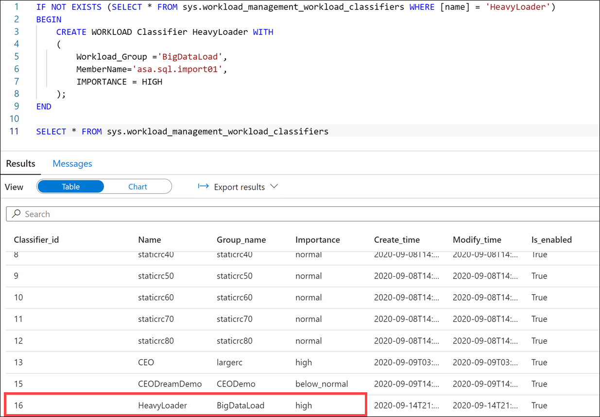

8. Navigate to the **Manage** hub.

    

9. Select **Linked services** in the left-hand menu **(1)**, then select a linked service named **`sqlpool01_import01` (2)**.

    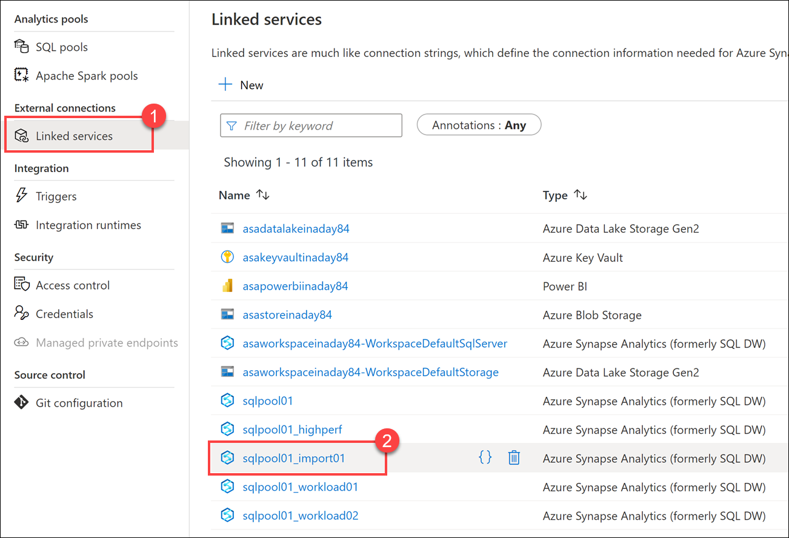

    > **Note:** If you do not see this or the other Synapse linked services, select **Refresh** at the top-right corner of Synapse Studio. If you recently ran the PowerShell script that creates these linked services, then they might not show up until you refresh.

    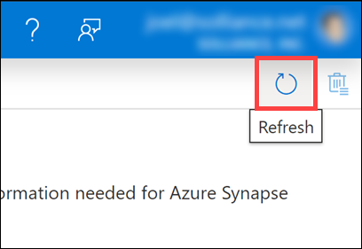

10. Notice that the user name for the dedicated SQL pool connection is the **`asa.sql.import01` user** we added to the `HeavyLoader` classifier. We will use this linked service in our new pipeline to reserve resources for the data load activity.

    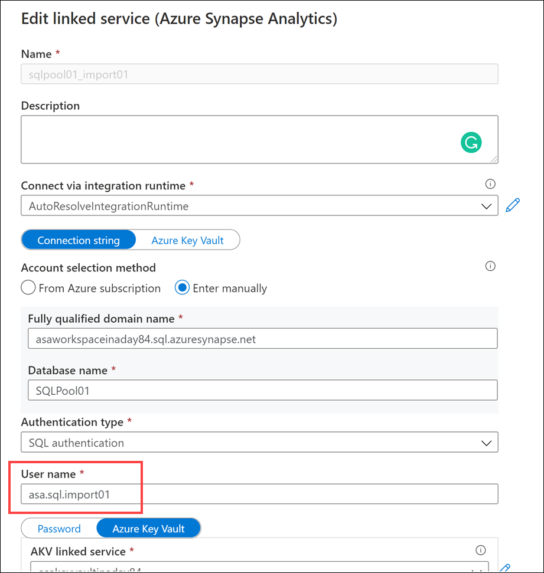

11. Select **Cancel** to close the dialog, and select **Discard changes** when prompted.

### Task 2: Create pipeline with copy activity

1. Navigate to the **Integrate** hub.

    

2. Select **+ (1)** then **Pipeline (2)** to create a new pipeline.

    

3. In the **Properties** pane for the new pipeline, enter the following **Name**: **`Copy December Sales`**.

    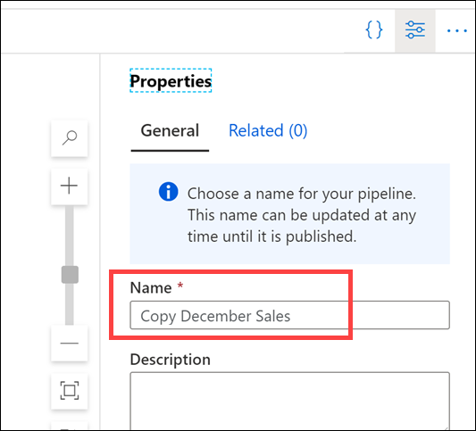

4. Expand **Move & transform** within the Activities list, then drag the **Copy data** activity onto the pipeline canvas.

    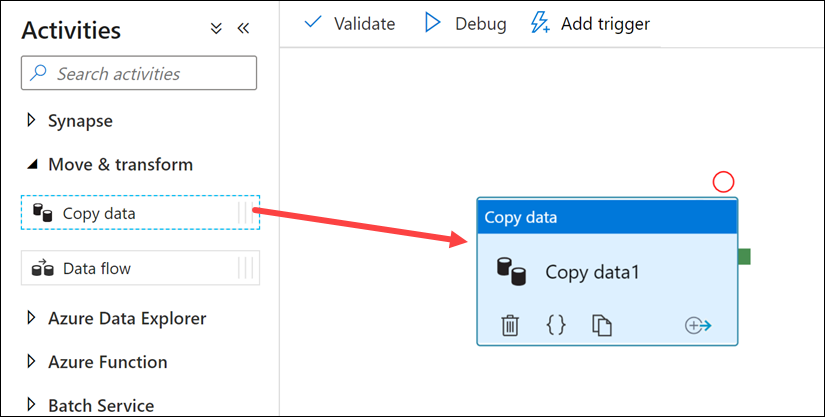

5. Select the **Copy data** activity on the canvas, select the **General** tab **(1)**, and set the **Name** to **`Copy Sales` (2)**.

    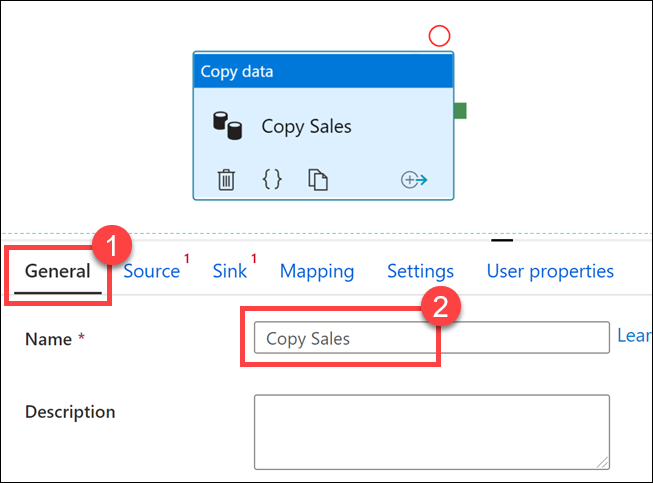

6. Select the **Source** tab **(1)**, then select **+ New (2)** next to `Source dataset`.

    

7. Select the **Azure Data Lake Storage Gen2** data store **(1)**, then select **Continue (2)**.

    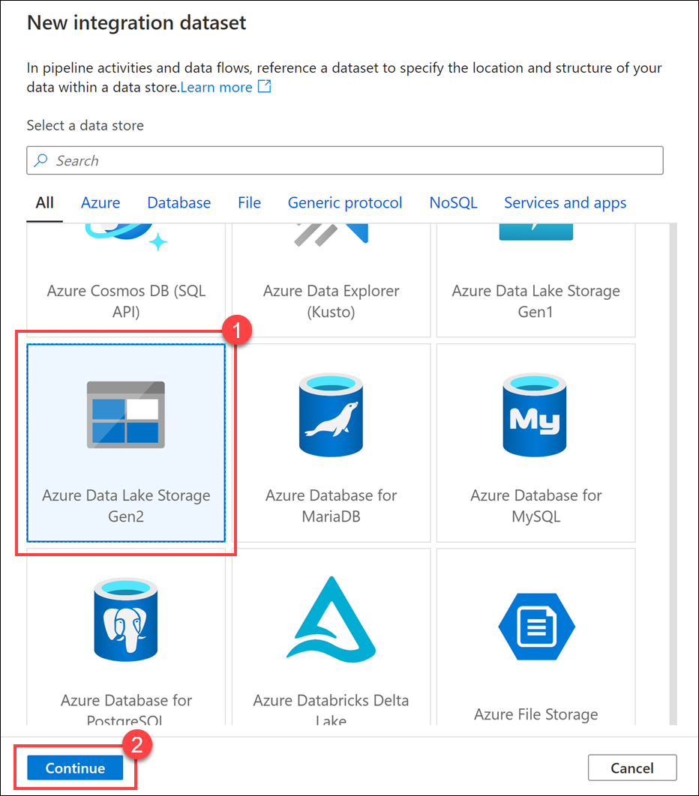

8. Choose the **Parquet** format **(1)**, then select **Continue (2)**.

    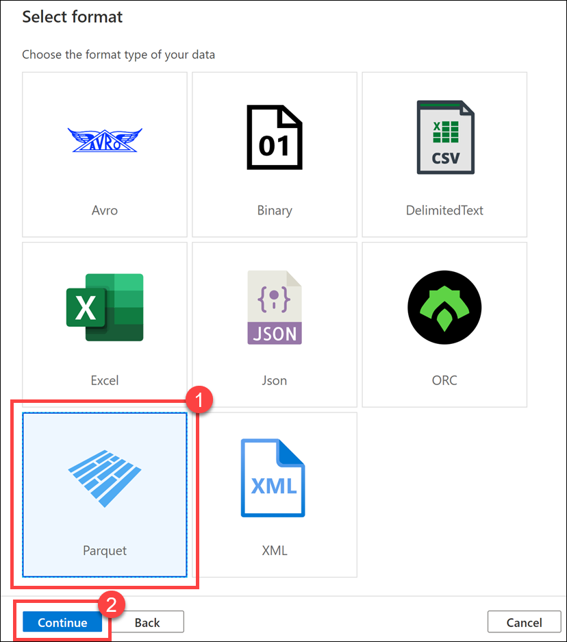

9. In the properties, set the name to **asal400_december_sales (1)** and select the **asadatalakeNNNNNN** linked service **(2)**. Browse to the **`wwi-02/campaign-analytics/sale-20161230-snappy.parquet`** file location **(3)**, select **From sample file (4)** for schema import. Browse to `C:\dp-203\data-engineering-ilt-deployment\Allfiles\samplefiles\sale-small-20100102-snappy.parquet` on your computer, then browse to it in the **Select file** field **(5)**. Select **OK (6)**.

    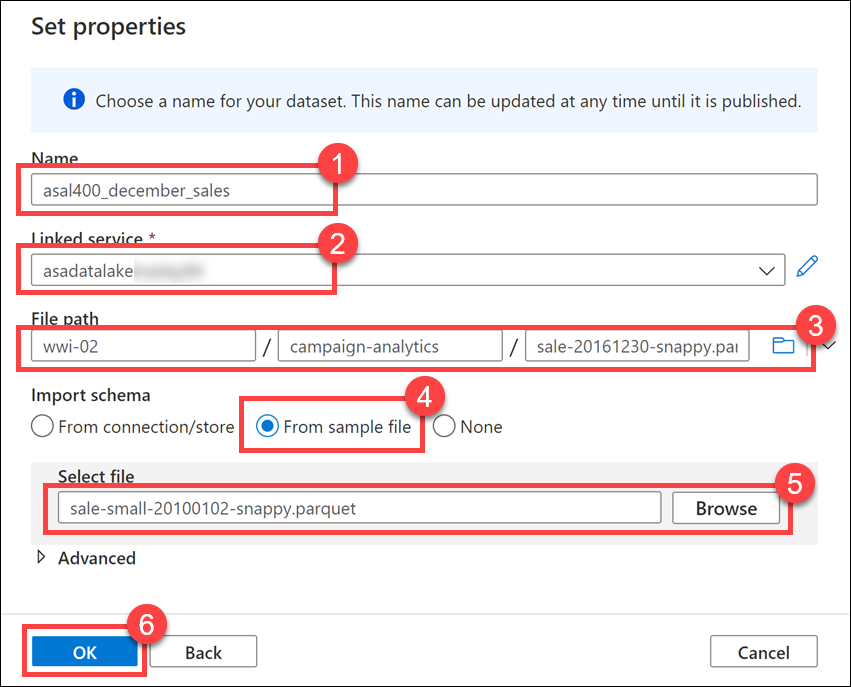

    We downloaded a sample Parquet file that has the exact same schema, but is much smaller. This is because the file we are copying is too large to automatically infer the schema in the copy activity source settings.

10. Select the **Sink** tab **(1)**, then select **+ New (2)** next to `Sink dataset`.

    

11. Select the **Azure Synapse Analytics** data store **(1)**, then select **Continue (2)**.

    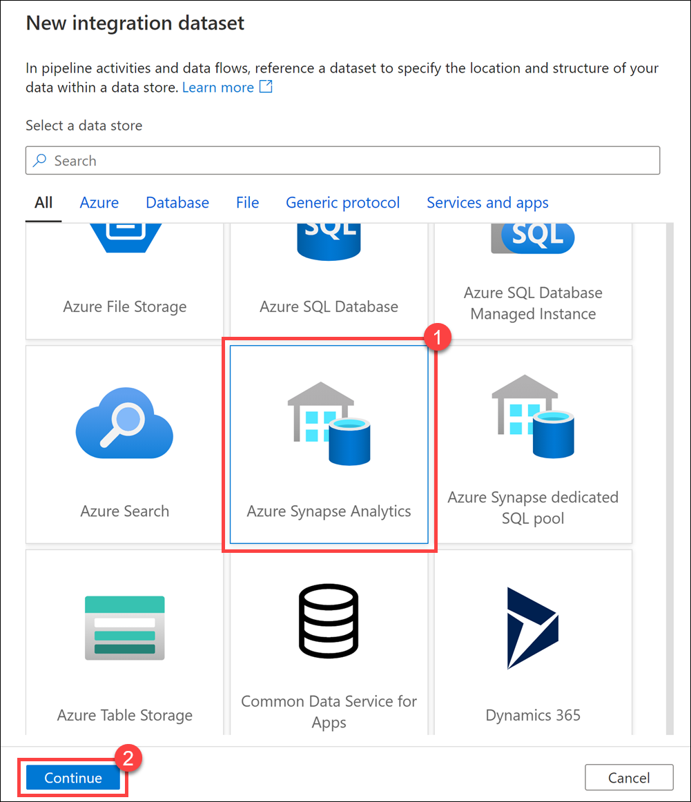

12. In the properties, set the name to **`asal400_saleheap_asa` (1)** and select the **sqlpool01_import01** linked service **(2)** that connects to Synapse Analytics with the `asa.sql.import01` user. For the table name, scroll the Table name dropdown and choose the **wwi_perf.Sale_Heap** table **(3)** then select **OK (4)**.

    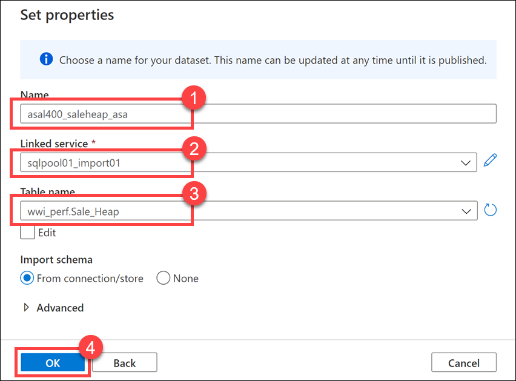

13. In the **Sink** tab, select the **Copy command (1)** copy method and enter the following in the pre-copy script to clear the table before import: **`TRUNCATE TABLE wwi_perf.Sale_Heap` (2)**.

    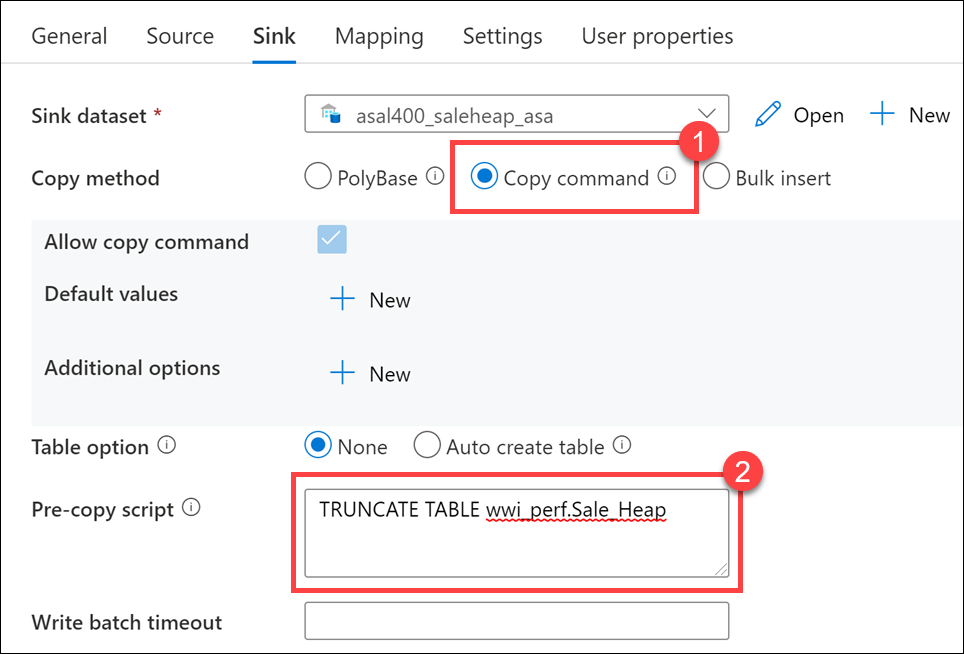

    The fastest and most scalable way to load data is through PolyBase or the COPY statement **(1)**, and the COPY statement provides the most flexibility for high-throughput data ingestion into the SQL pool.

14. Select the **Mapping** tab **(1)** and select **Import schemas (2)** to create mappings for each source and destination field. Select **`TransactionDate`** in the source column **(3)** to map it to the `TransactionDateId` destination column.

    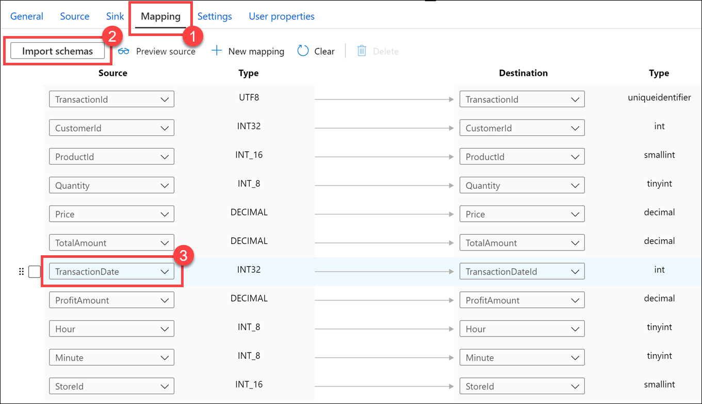

15. Select the **Settings** tab **(1)** and set the **Data integration unit** to **`8` (2)**. This is required due to the large size of the source Parquet file.

    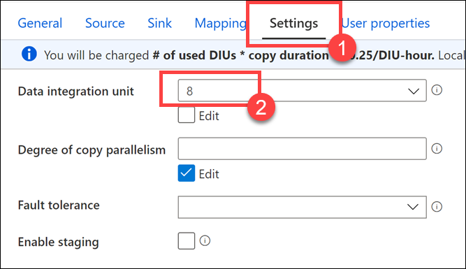

16. Select **Publish all**, then **Publish** to save your new resources.

    

17. Select **Add trigger (1)**, then **Trigger now (2)**. Select **OK** in the pipeline run trigger to begin.

    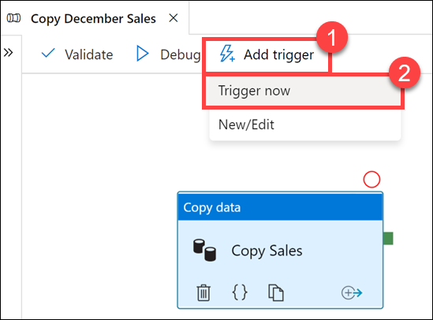

18. Navigate to the **Monitor** hub.

    

19. Select **Pipeline Runs (1)**. You can see the status **(2)** of your pipeline run here. Note that you may need to refresh the view **(3)**. Once the pipeline run is complete, you can query the `wwi_perf.Sale_Heap` table to view the imported data.

    

## Exercise 3: Cleanup

Complete these steps to free up resources you no longer need.

### Task 1: Pause the dedicated SQL pool

1. Open Synapse Studio (<https://web.azuresynapse.net/>).

2. Select the **Manage** hub.

    

3. Select **SQL pools** in the left-hand menu **(1)**. Hover over the name of the dedicated SQL pool and select **Pause (2)**.

    

4. When prompted, select **Pause**.

    
